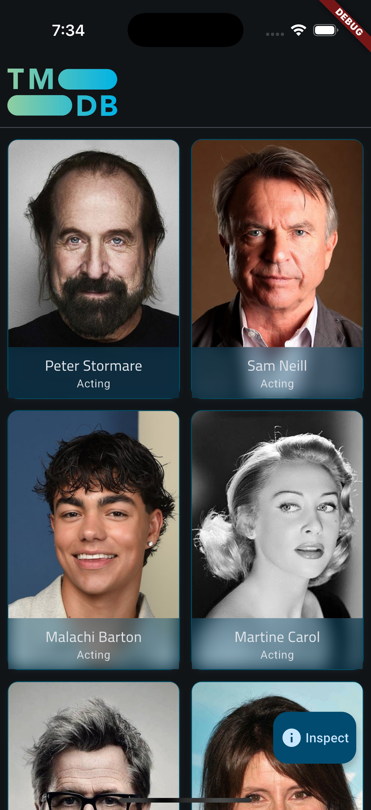
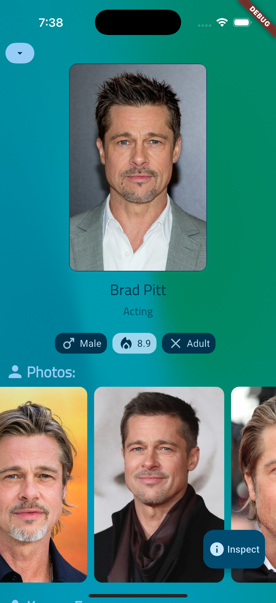
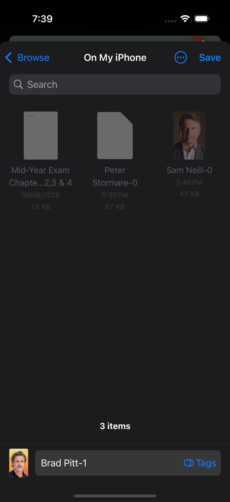

# Movies (Flutter + TMDB)
<table>
  <tr>
    <td></td>
  </tr>
</table> 
A Flutter app that browses movies from The Movie Database (TMDB): discover, search, and view details.


## Features
- Browse popular people (infinite scroll)
- View person details and their known for movies
- Search people by name
- Save first page of popular people and view it if offline.

## Screenshots

<table>
  <tr>
    <td></td>
    <td></td>
  </tr>
 <tr>
        <td></td>
        <td></td>
</tr>
 <tr>
        <td></td>
        <td></td>
</tr>
</table>

## Requirements
- Preferably: Flutter 3.3X.X
- A TMDB API key: https://www.themoviedb.org/settings/api

## Configuration
Use dart-define to provide runtime configuration:
- API_TOKEN: your TMDB API key

Example read in Dart:
```dart
const tmdbApiKey = String.fromEnvironment('API_TOKEN');
```

## Getting Started

1) Install Flutter and set up devices.
2) Fetch dependencies:
  ```bash
  flutter pub get
  ```
3) Run the app (replace YOUR_KEY):
  ```bash
  flutter run \
    --dart-define=API_TOKEN=YOUR_KEY 
  ```
or
using a config file (environment.json):
  ```bash
  flutter run \
    --dart-define-from-file=environment.json
  ```


## Project Structure

```
lib/ 
├── core/ 
│   ├── extensions/ 
│   ├── failures/
│   ├── generated/
│   ├── failures/
│   ├── network/
│   ├── router/
│   ├── theme/
│   ├── widgets/
│   ├── service_locator/
│   │   ├── service_locator.dart
│   │   └── service_locator.config.dart
│   └── usecases/
├── data/
│   ├── models/
│   └── repos_impl/
├── domain/
│   ├── entities/
│   ├── repos/
│   └── usecases/
└── presentation/
├── managers/     
├── views/        
└── shared/widgets/
```
## Dependencies
- equatable ^2.0.7
- dio ^5.9.0
- dartz ^0.10.1
- skeletonizer ^2.1.0+1
- get_it ^8.2.0
- pretty_dio_logger ^1.4.0
- injectable ^2.5.1
- google_fonts ^6.3.1
- cached_network_image ^3.4.1
- flutter_gen ^5.11.0
- flutter_native_splash ^2.4.6
- alice ^1.0.0
- alice_dio ^1.0.7
- blur ^4.0.2
- flutter_bloc ^9.1.1
- freezed_annotation ^3.1.0
- go_router ^16.2.1
- file_picker ^10.3.2
- mesh_gradient ^1.3.8
- flutter_cache_manager ^3.4.1
- loader_overlay ^5.0.0

## Dev Dependencies
- flutter_test (SDK)
- flutter_lints ^5.0.0
- build_runner ^2.7.0
- injectable_generator ^2.8.1
- flutter_gen_runner ^5.11.0
- flutter_launcher_icons ^0.14.4
- freezed ^3.2.0

## Credits

Data provided by TMDB. This product uses the TMDB API but is not endorsed or certified by TMDB.
